# Collaborative Robotic System

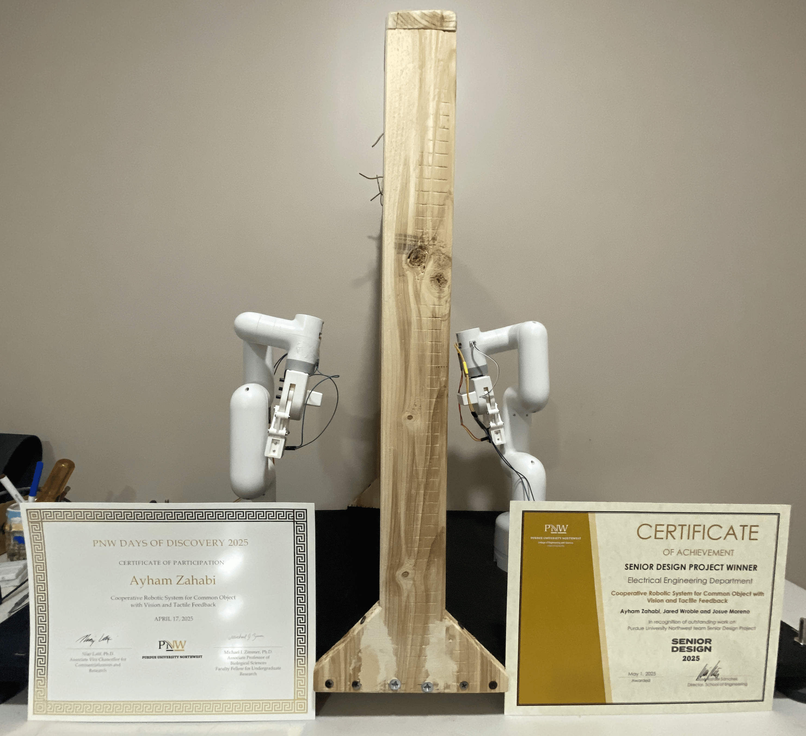
_Finalized system with both awards for best senior design project (right) and days of discovery participation (left)._

[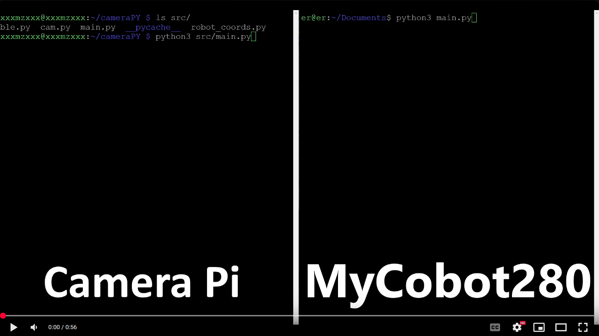](https://youtu.be/RW2bq7RRWUk "First System Tests - Click to Watch!")
_First system showcase after development of CLI (Command-Line Interface) - February 2025_

[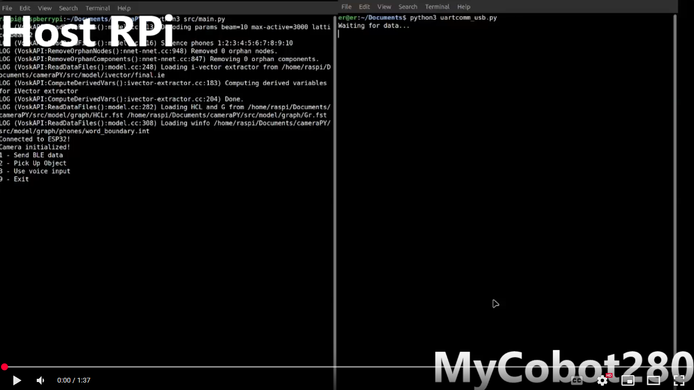](https://www.youtube.com/watch?v=r-28v-Ilo_s "Intermediate System Tests - Click to Watch!")
_Intermediate system showcase after natural language processing integration and full one arm capability - March 2025_

[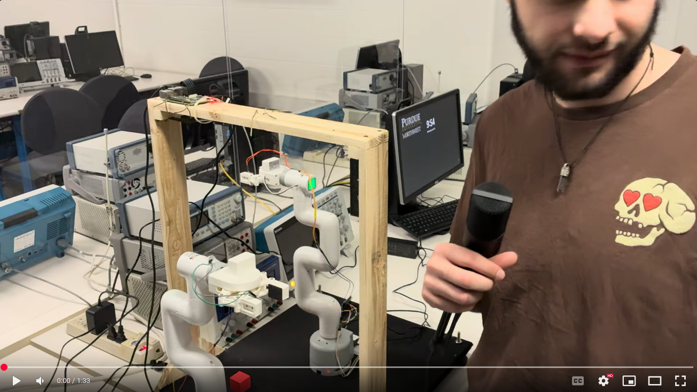](https://www.youtube.com/watch?v=DHkCtAWtM5U "Final System Showcase - Click to Watch!")
_Final system showcase after project completion - April 2025_

## Summary

The goal of this project is to create an advanced, reliable, and user friendly collaborative robotic system capable of understanding and executing tasks based on vocal commands. The system integrates natural language processing (NLP) for user interaction, allowing users to control the robotic arms via speech commands. Usability testing, conducted with 10 participants from diverse backgrounds, showed an average ease of use score of 7.4 out of 10, with challenges observed in understanding speech with heavy accents and processing time for longer commands. Efficiency was evaluated by measuring the time taken to complete tasks under various conditions, with results indicating that both the number of commands and object distance negatively impacted task completion time. In accuracy testing, the system classified objects with 98% accuracy under ideal lighting conditions and successfully lifted objects 86.7% of the time, though performance decreased on the far right side of the workspace. These findings demonstrate the potential of combining NLP with robotic systems, while also highlighting areas for further improvement in task processing speed and lifting precision.

## Overview

The purpose of this research project is to enhance an existing cooperative robotic system by integrating a voice controlled artificial intelligence (AI) interface. This integration aims to increase ease of use, boost operational efficiency, and expand the system's capabilities. The system is composed of two [Elephant Robotics MyCobot280 Pi arms](https://shop.elephantrobotics.com/products/mycobot-pi-worlds-smallest-and-lightest-six-axis-collaborative-robot?variant=44597817803064), two ESP32 microcontrollers, a Raspberry Pi 4B board, and two force sensing resistors (FSR).

## Approach

When designing the system we began by determining what the final result we wanted was. We decided we wanted a system that could first take in a vocal command from a user, tokenize and understand the command, perform some action based on the command, return a success/fail feedback message to the user, and then reset back to the original system state. To better understand the goal we created a blackbox diagram to follow as we ironed out the system details.

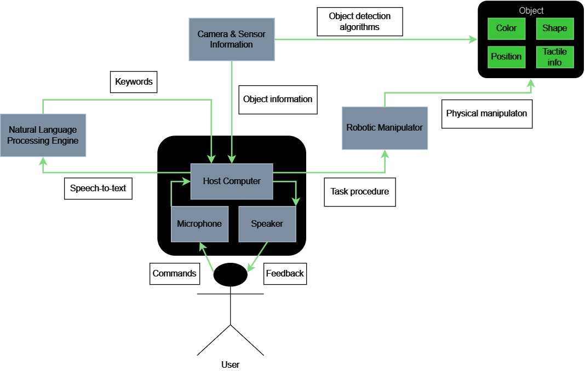

### Planning & Design

During initial testing, the system worked but was not practical for real world use. Several areas for improvement were identified:

- **Continuous Operation**

  - Original setup required manual steps for each object.
  - Planned a **cyclic design** that runs continuously, detects multiple objects, processes commands, and executes tasks without rebooting.

- **Peripheral Free Control**

  - System originally depended on a keyboard, mouse, and monitor.
  - myCobot280 was reconfigured as a **Wi-Fi access point**, enabling wireless control from external devices and removing workspace clutter.

- **Microcontroller Upgrade**

  - Romeo BLE board used parallel wiring (8 wires for 1 byte), cluttering the I/O panel.
  - Replaced with an **ESP32**, which supports I²C (only 2 wires) and 12-bit data transmission for a cleaner, more efficient setup.

- **Simplified Startup & Control**

  - Original system needed a server host, manual connections, and a Python script.
  - Added **natural language processing (NLP) voice command control** for ease of use.
  - Replaced server dependency with **Bluetooth Low Energy (BLE)** for lightweight, energy efficient communication.

- **Workspace Redesign**
  - Adjusted physical layout to prevent arm collisions.
  - Ensured at least **100 mm overlapping workspace** for collaborative operation between arms.
  - A draft sketch of the workspace was created.
    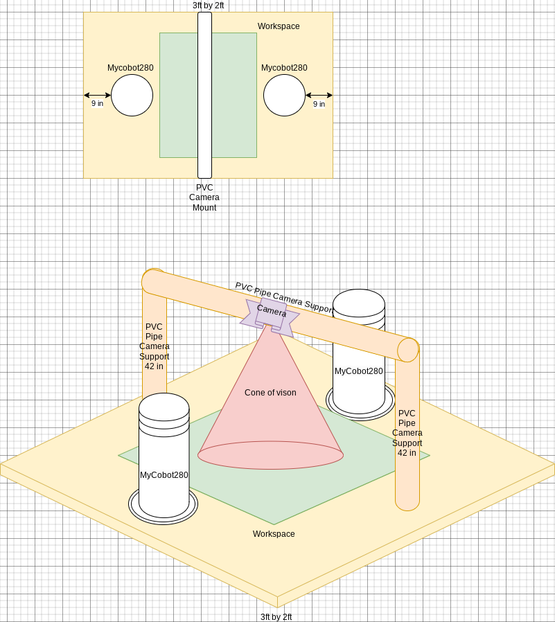

All design decisions were backed by documentation review and feasibility research to ensure compatibility with project goals and deadlines.

### Development & Integration

The development phase focused on refactoring, communication setup, workspace construction, and feature integration.

- **Code Refactoring & CLI**

  - All legacy code was modularized into functions for readability and to support the cyclic design.
  - A **command line interface (CLI)** was developed for more efficient testing and as a backup for noisy environments where speech input isn’t practical.

- **Robotic Arm & Camera Communication**

  - Established communication between the **myCobot280** robotic arm and the **Raspberry Pi camera**.
  - Camera captured images, calculated object positions, and transmitted joint movement data.
  - Initial Bluetooth module conflicts were resolved by routing BLE through an **ESP32 (via USB)**, which handled forwarding data to the arm.
  - Development used **ESP-IDF in C**. The ESP32 acted as a **GATT server** and transmitted data over **I²C**, later switched to **UART** after I²C integration was causing issues.

- **Object Detection Improvements**

  - Original algorithm only detected one object.
  - New algorithm:
    - Applied a threshold to classify pixels as object versus background.
    - Grouped pixels and drew bounding boxes with center dots.
    - Stored detected object colors and coordinates in an array.
    - Supported up to **10 objects per image**.
  - Example showcasing old (right) object detection versus new (left) object detection and classification. 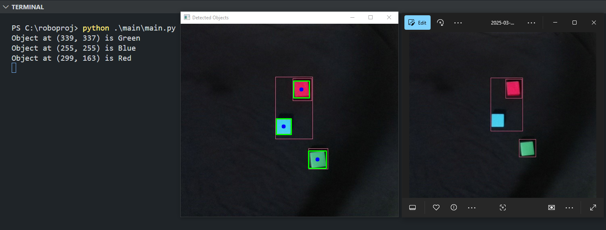

- **Workspace Construction**

  - Built from wood with **two central support beams**.
  - Raspberry Pi mounted on top with the camera mounted underneath facing workspace.
  - Black fabric added for consistent lighting/background to reduce camera distortion.
  - Both robotic arms mounted, with **force sensing resistors (FSRs)** taped onto each gripper.
  - **ESP32 ADC code** converted FSR signals and sent them over **UART** when needed.
  - Completed workspace, side and front views.
    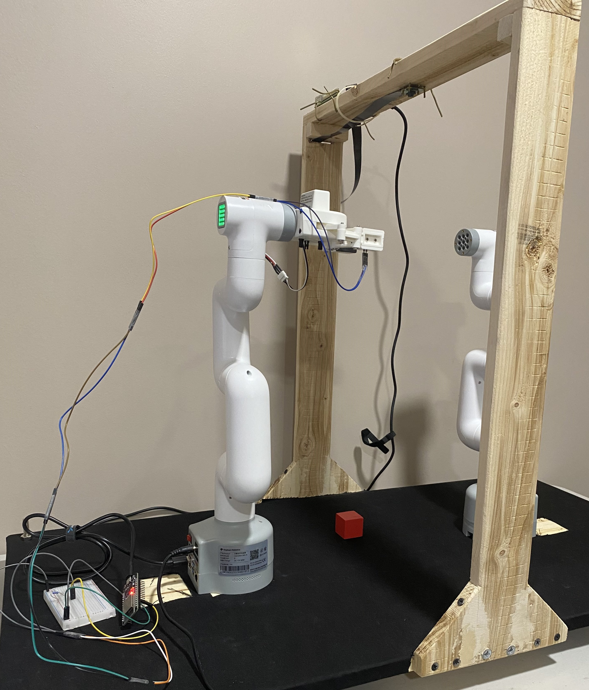
    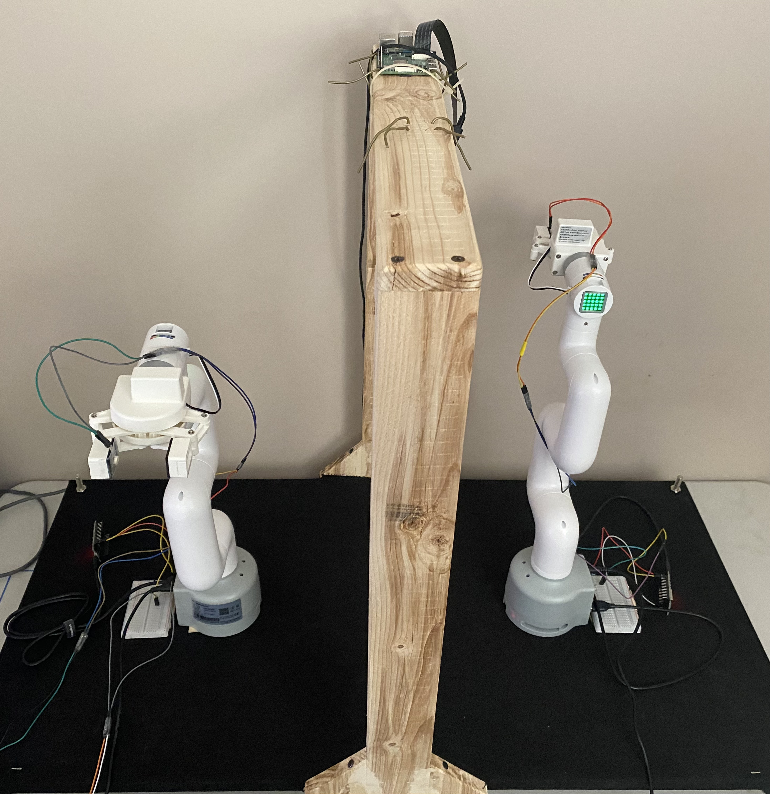

- **Natural Language Processing (NLP)**
  - Integrated voice command control using **Vosk** on the Raspberry Pi.
  - Recognized keywords like `pick up`, with optional attributes (`color`, `arm`) processed via **FIFO queues**.
  - Supported **sequential commands** using the word `then` (e.g., _“pick up blue then pick up red”_).
  - Example of sequential command FIFO queue.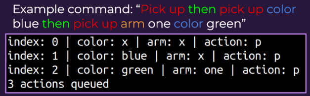

### Validation & Testing

Three major areas of the robotic system were evaluated: **control mechanism**, **efficiency**, and **accuracy**.

- **Control Mechanism**

  - Participants from diverse backgrounds operated the system to complete a simple task.
  - Afterward, they rated ease of use on a **1–10 scale** (1 = extremely difficult, 10 = very easy).
  - Provided insight into the usability of the control mechanism in realistic scenarios.

- **Efficiency**

  - Measured the time (in seconds) from receiving a **voice command** to:
    - Successful object removal from the workspace.
    - Reporting a failed pick up.
  - Failures were induced by removing objects post image capture or blocking the arm’s path.
  - **Force sensing resistors (FSRs)** detected absence of objects in the gripper and triggered failure reports.

- **Accuracy**
  - Tested using **three colored cubes**: red, green, and blue.
  - System performance evaluated in two phases:
    1. **Detection & Classification** → compared human observation vs. camera algorithm output.
    2. **Physical Pick Up** → pass/fail based on whether the gripper successfully lifted the cube without dropping it.

## Results

Testing demonstrated how natural language processing, task efficiency, and object handling impacted system performance.

- **Control Mechanism (User Experience)**

  - Adding **NLP voice control** improved usability.
  - Average ease of use score from **10 participants**: **7.4 / 10**.
  - Trouble areas included:
    - Difficulty understanding accented speech.
    - Increased computation time for longer commands.
  - Ease of use test results.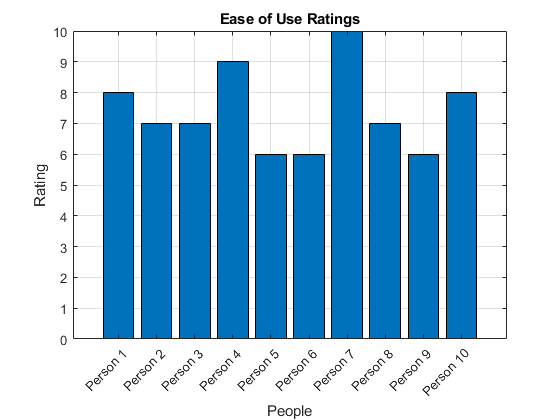

- **Efficiency**

  - Tasks tested across four groups:
    1. Multi-command + close object (50 mm)
    2. Single command + close object
    3. Multi-command + far object (150 mm)
    4. Single command + far object
  - Findings:
    - More commands and greater object distance **increased task completion time**.
    - Fail cases (object removed or arm blocked) showed **similar response times**.
  - Time test results.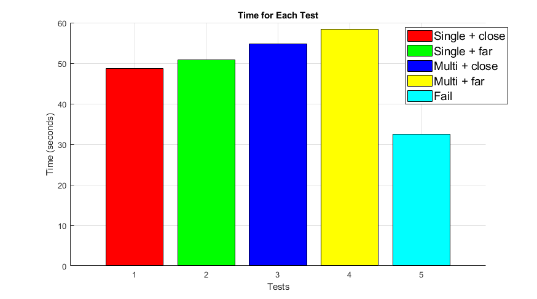

- **Accuracy**
  - **Object classification:** 98% accuracy for red, green, and blue cubes (under controlled lighting).
  - **Pick up success rate:** 86.7% (13/15 trials).
  - Failures occurred mainly on the **far right of the workspace**, likely due to camera distortion.
